# SOC Detection & Response Lab

A hands-on purple team project: simulate real MITRE ATT&CK techniques against a monitored Windows endpoint, measure whether [Wazuh](https://wazuh.com/) actually detects them, close the gaps with Sysmon and custom rules, and build an automated triage-to-response pipeline on top — AI-assisted analysis, Discord alerting, incident ticketing, a Grafana dashboard, and Wazuh Active Response-based host isolation.

This is **Project 2**, built on top of a home SOC lab (Wazuh + NetAlertX + Grafana + a Gemini-based AI analyst) documented separately as Project 1.

> **Lab disclaimer:** everything here runs on an isolated VMware NAT network with two VMs I own. All "attacks" are [Atomic Red Team](https://github.com/redcanaryco/atomic-red-team) test cases run against my own endpoint for detection-engineering purposes, not against any system I don't control.

---

## Table of contents

- [Why this exists](#why-this-exists)
- [Architecture](#architecture)
- [Phase 1–3: Detection engineering](#phase-13-detection-engineering)
- [Phase 4: Resilience engineering](#phase-4-resilience-engineering)
- [Phase 4: AI triage + rule-based backstop](#phase-4-ai-triage--rule-based-backstop)
- [Phase 4: Ticketing & dashboards](#phase-4-ticketing--dashboards)
- [Phase 4: Automated response (host isolation)](#phase-4-automated-response-host-isolation)
- [Lessons learned / what I'd do differently](#lessons-learned--what-id-do-differently)
- [Repo structure](#repo-structure)
- [Setup / reproduce this](#setup--reproduce-this)

---

## Why this exists

Most home-lab SOC projects stop at "I installed a SIEM and it shows logs." The real job of a detection engineer is answering a harder question: **when a specific attacker technique actually happens, does my monitoring catch it — and if not, why not, and what do I do about it?**

This project answers that question for five real ATT&CK techniques, documents one deliberate detection gap instead of hiding it, and then goes a step further: it turns detections into an actual response pipeline, the same shape (if much smaller) as what a real SOC runs — triage, alerting, ticketing, and automated containment, with a documented dry-run safety stage before anything touches a live system.

I'm building this to break into a cybersecurity role, so I optimized for **provable, reproducible, and honest** results over a polished demo. Where something didn't work on the first try (and a lot didn't), I kept the evidence instead of cutting it.

---

## Architecture

```
┌─────────────────────────────┐         ┌──────────────────────────────────────┐
│   Windows 10 VM (endpoint)   │         │   Ubuntu 22.04 VM                     │
│   192.168.50.40               │         │   192.168.50.50                        │
│                               │         │                                         │
│   • Atomic Red Team           │  Wazuh  │   • Wazuh Manager / Indexer / Dashboard │
│   • Sysmon v15.22             │  agent  │   • Custom Sysmon detection rule (T1490)│
│     (SwiftOnSecurity config   │────────▶│   • Python/Gemini AI forwarder          │
│      + custom T1490 rule)     │  logs   │       - retry + fallback logic          │
│   • Wazuh agent                │         │       - masquerading rule + risk floors│
│   • Active Response scripts    │◀────────│       - auto-ticketing + dedup          │
│     (isolate.cmd / unisolate)  │  AR cmd │       - Discord alerting                │
│                               │         │       - Wazuh Active Response trigger   │
│                               │         │   • Grafana (open-incidents dashboard)  │
└─────────────────────────────┘         └──────────────────────────────────────┘
```

Isolated VMware NAT network, firewall scoped to the Windows VM's IP only. No production systems, no external targets.

---

## Phase 1–3: Detection engineering

Installed [Atomic Red Team](https://github.com/redcanaryco/atomic-red-team) on the Windows endpoint (345 technique folders) and ran individual atomic tests against a baseline Wazuh agent install — no Sysmon yet — to see what Wazuh actually catches out of the box.

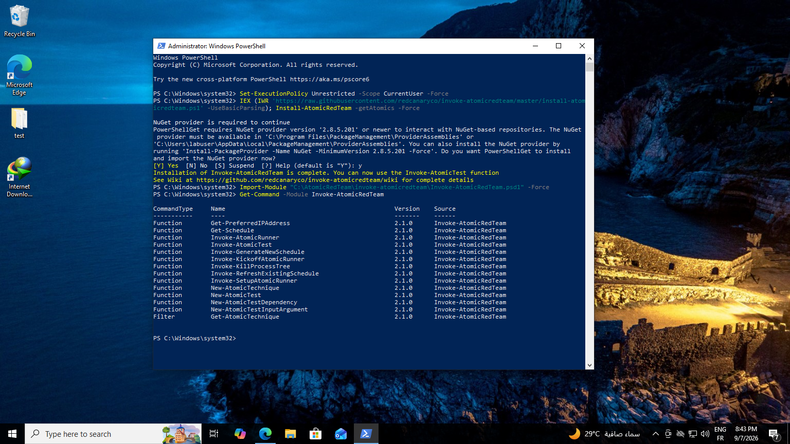

**Baseline result: mostly blind.** Wazuh's default FIM/log-based ruleset missed process-level and registry-level attacker activity entirely.


Installed **Sysmon v15.22** with the SwiftOnSecurity config, and extended the Wazuh agent's `ossec.conf` to read the `Microsoft-Windows-Sysmon/Operational` event channel.

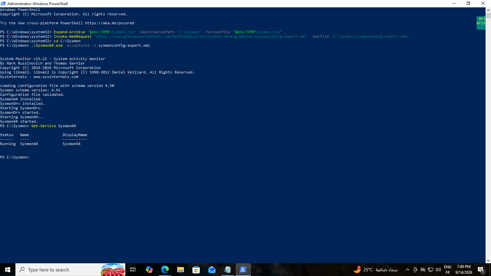

That alone closed most of the gap:

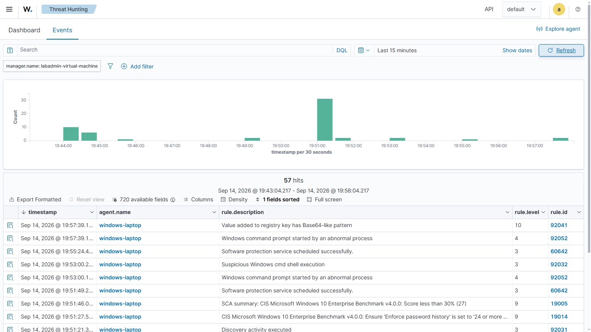
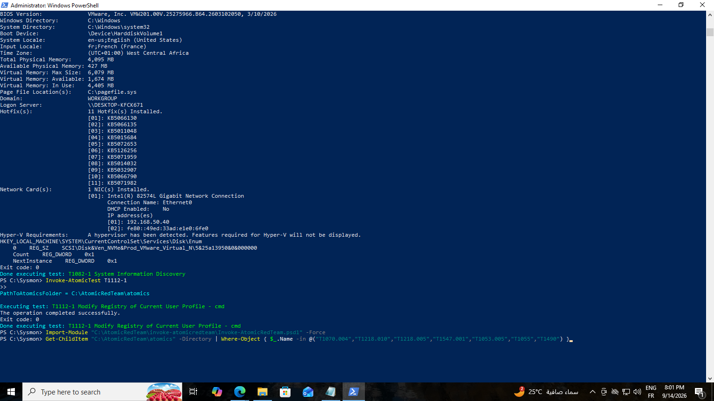
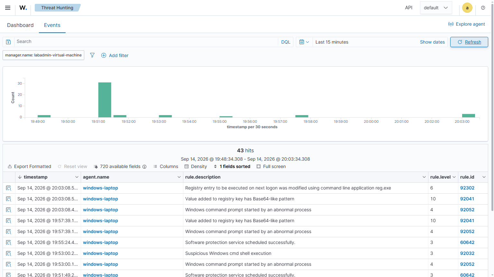

One technique — **T1490 (Inhibit System Recovery / Disable System Restore)** — still wasn't specifically detected, even with Sysmon running, because the default config didn't tag the relevant registry paths. I added a **custom Sysmon rule** targeting `SystemRestore\DisableSR` and `SystemRestore\DisableConfig`:

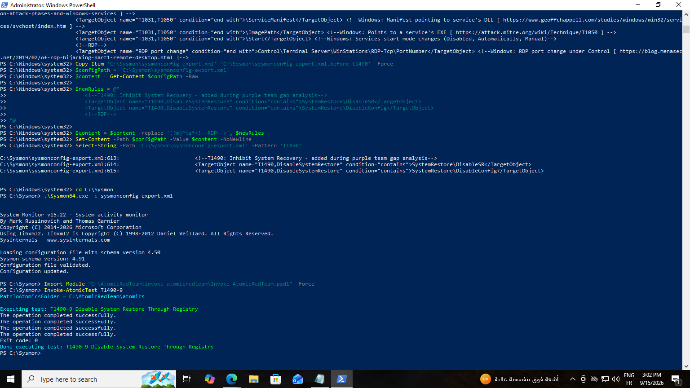

One technique — **T1070.004 (Indicator Removal: File Deletion)** — I left undetected on purpose. Sysmon's default config excludes routine file-delete events to cut noise; catching it would require a much noisier config trade-off I judged not worth it for this lab. Documenting a gap you chose not to close, and why, is itself a detection-engineering decision.

### Final detection coverage

| Technique | Tactic | Before Sysmon | After Sysmon | Rule | Notes |
|---|---|:---:|:---:|---|---|
| T1082 — System Information Discovery | Discovery | ❌ | ✅ | 92031 | No process visibility before; Sysmon closed it |
| T1112 — Modify Registry (HKCU) | Defense Evasion | ❌ | ✅ | — | HKCU registry write now covered |
| T1547.001 — Registry Run Key | Persistence | *(not tested before)* | ✅ | 92302 | Precise, correct detection |
| T1070.004 — File Deletion | Defense Evasion | *(not tested before)* | ❌ | — | Deliberate: default Sysmon config excludes routine deletes to reduce noise |
| T1490 — Disable System Restore | Impact | ❌ | ✅ | 92041 + custom rule | Custom Sysmon rule confirmed tagging the raw event; the Wazuh alert itself fired via a separate built-in rule matching the process command line, not the targeted registry rule — a small but real nuance in how detection and alerting can diverge |

**4 of 5 detected. 1 deliberately left as a documented, reasoned trade-off.**

---

## Phase 4: Resilience engineering

The next phase built an automated pipeline: a Python forwarder tails Wazuh's alert log, sends file-integrity events to Google's Gemini API for AI-assisted triage, and posts high-severity results to Discord. The first version worked — until it hit a real Gemini outage, and I found out the hard way that **naive retry logic can take down your entire alert pipeline**, not just one alert.

**The bug:** on any Gemini failure, the forwarder re-read the same alert and retried forever, without advancing its position in the log. One bad or rate-limited event blocked every alert behind it, indefinitely.

**The fix:** a bounded retry counter (5 attempts), after which the event is marked permanently failed, the pipeline advances, and — critically — a **fallback record is still generated** from Wazuh's own rule data (rule level, description, agent, file path) rather than being silently dropped. A security tool that goes blind when its AI dependency has a bad day is a worse tool than one that degrades gracefully.

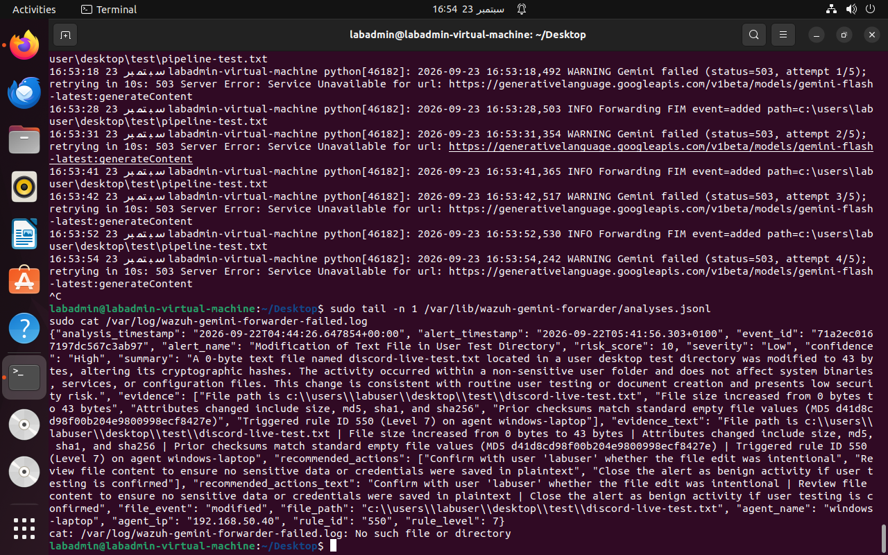
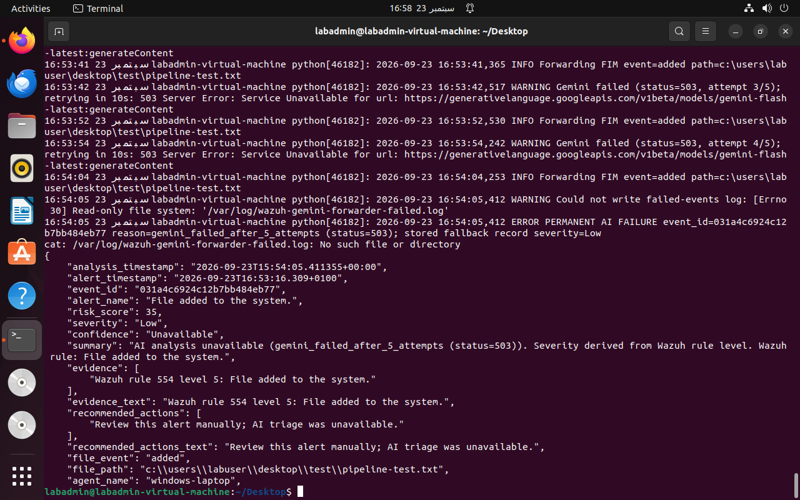

I hit this for real, not just in a synthetic test — Gemini's daily quota genuinely ran out mid-project from heavy testing, and the fallback path kept producing usable, Wazuh-derived severity scores the whole time:

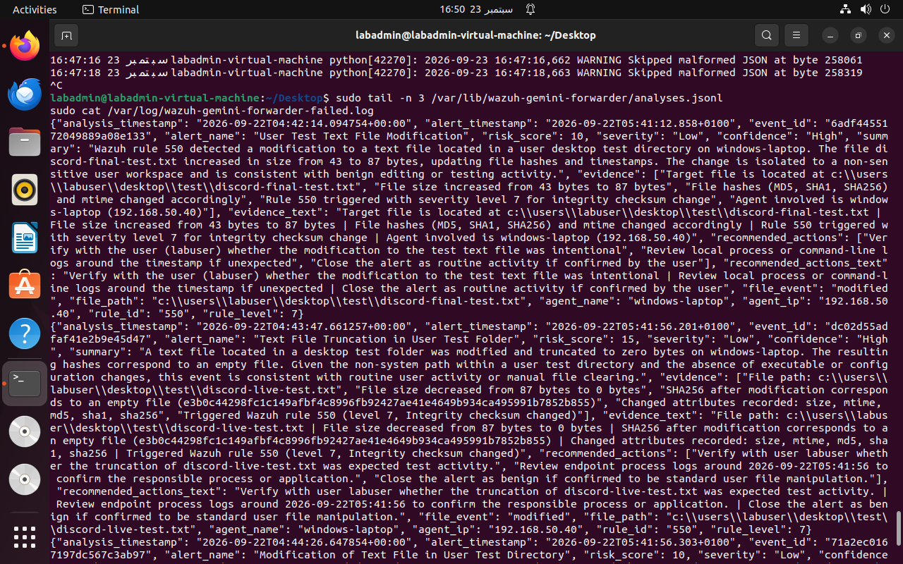

Also found and fixed: a **partial-line read bug**, where the forwarder occasionally read an alert while Wazuh was still writing it to disk, got half a JSON line, failed to parse it, and silently dropped the event. Fixed by checking for a trailing newline before consuming a line, and re-reading it on the next cycle if it's incomplete.

---

## Phase 4: AI triage + rule-based backstop

Gemini scoring alone isn't fully deterministic — the same `svchost.exe`-in-a-user-folder test scored 40, 45, 65, and 70 across separate runs, sitting right on the High/Medium boundary. For a security-relevant signal like process masquerading, I didn't want detection quality to depend on the AI's mood that day.

**Fix: a deterministic escalation rule.** If a file matches a known system-binary name (`svchost.exe`, `lsass.exe`, `csrss.exe`, etc.) and lives outside `C:\Windows`, the forwarder raises — never lowers — the risk score to at least a per-binary floor, regardless of what the AI said:

| Binary | Floor | Rationale |
|---|:---:|---|
| `lsass.exe` | 85 (Critical) | credential-dumping target |
| `svchost.exe`, `csrss.exe`, `winlogon.exe`, `services.exe` | 75 (High) | core system processes |
| `spoolsv.exe`, `explorer.exe`, `conhost.exe` | 70 (High) | common but lower-value targets |
| `cmd.exe`, `powershell.exe`, `rundll32.exe` | 65 (Medium) | legitimate tools frequently copied around |

Tested with both a **positive case** (a real `svchost.exe` masquerade, naturally scored and alerted via Discord with no manual intervention) and a **negative control** (a harmless file, `holiday-photo.bin`, correctly scored Low with no false alert):

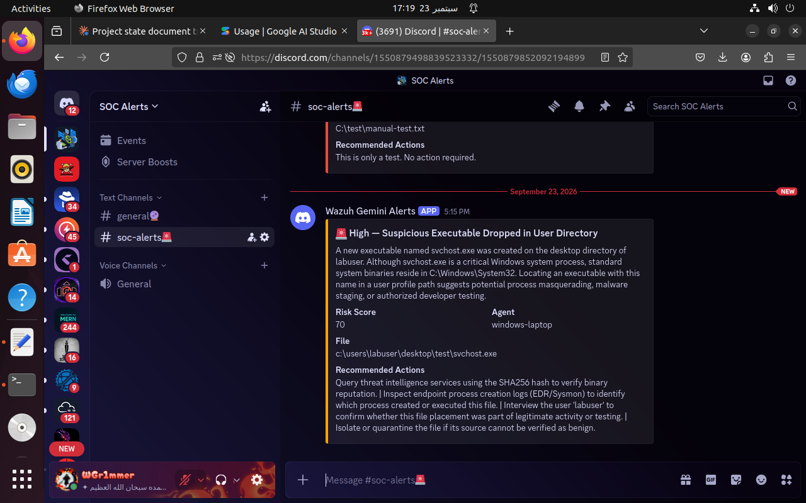
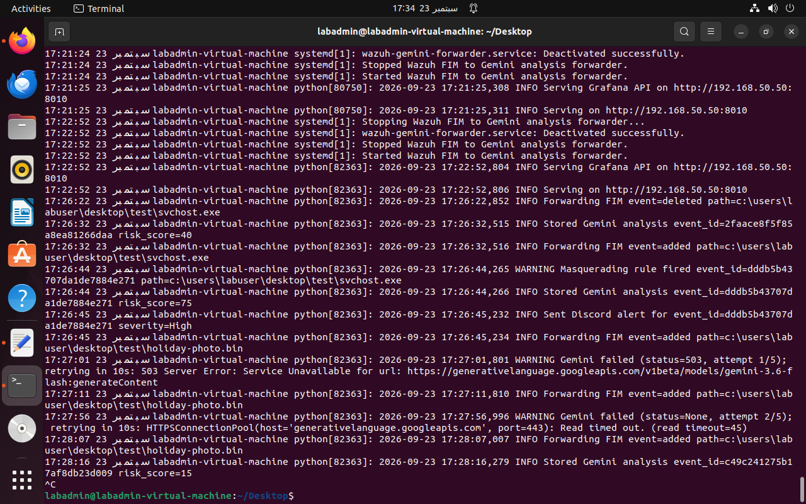

This produced a real, defensible risk spread across the five test binaries — not everything pinned at the same number:

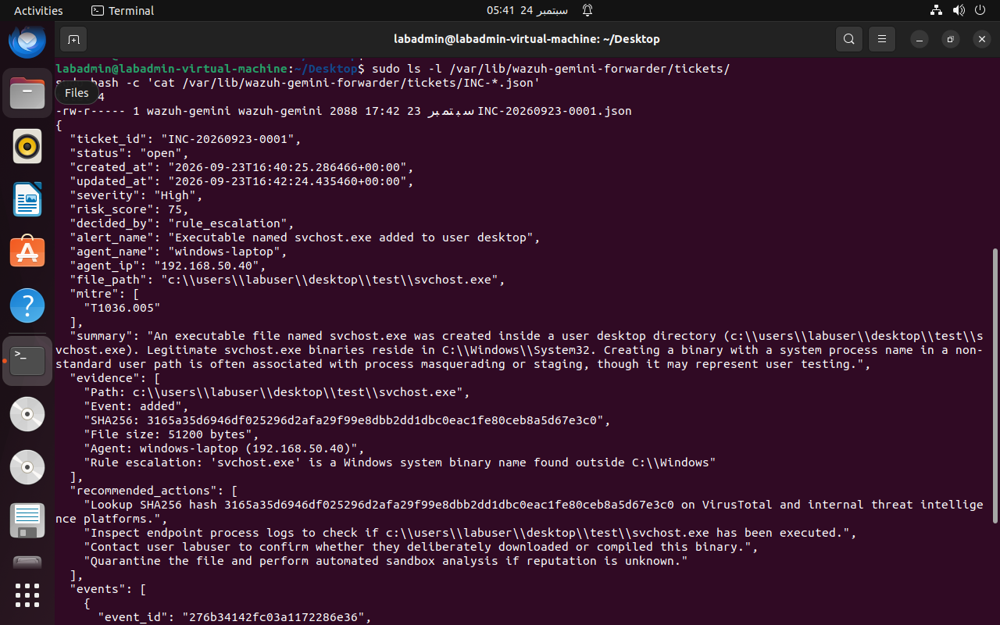

---

## Phase 4: Ticketing & dashboards

Every High/Critical detection — however it was decided (Gemini, the masquerading rule, or the fallback path) — creates a structured **incident ticket**, not just a chat message. Repeat events on the same host/file within a time window are deduplicated into the same ticket instead of spamming duplicates.

Each ticket carries:
- A unique ID (`INC-YYYYMMDD-NNNN`)
- Severity, risk score, and **which layer decided it** (`gemini` / `rule_escalation` / `ai_fallback`)
- MITRE ATT&CK tagging where applicable (e.g. `T1036.005` for masquerading)
- Evidence, recommended actions, and a full event history
- A lifecycle: open → closed, with a resolution note and who closed it

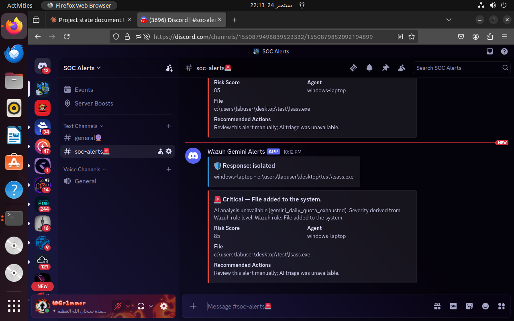
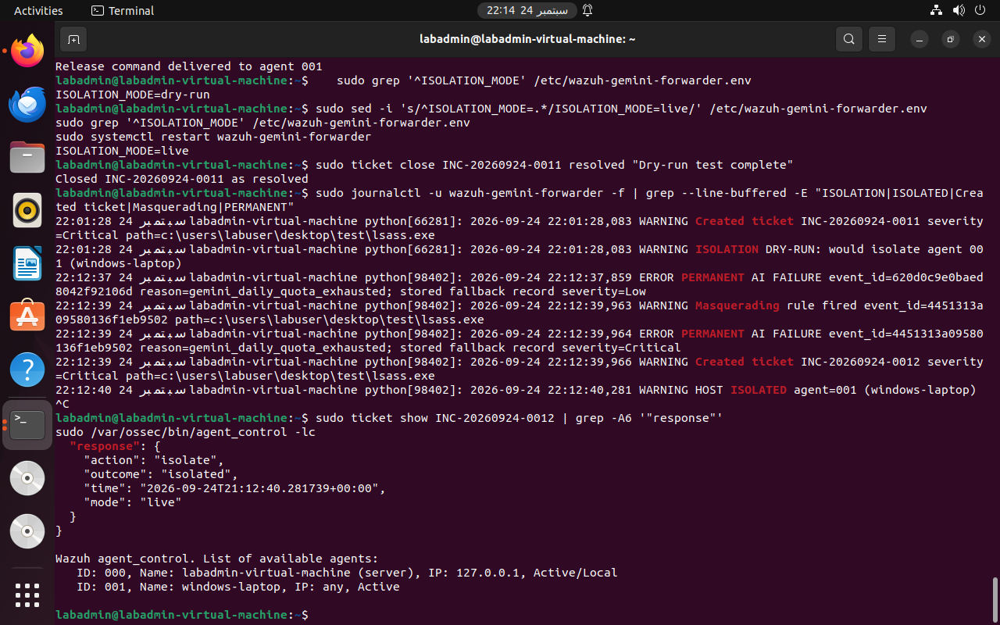

A read-only, API-key-authenticated `/api/tickets` endpoint feeds a **Grafana dashboard** showing open incidents alongside the existing FIM event timeline and AI risk-score distribution — turning individual alerts into an at-a-glance SOC view:

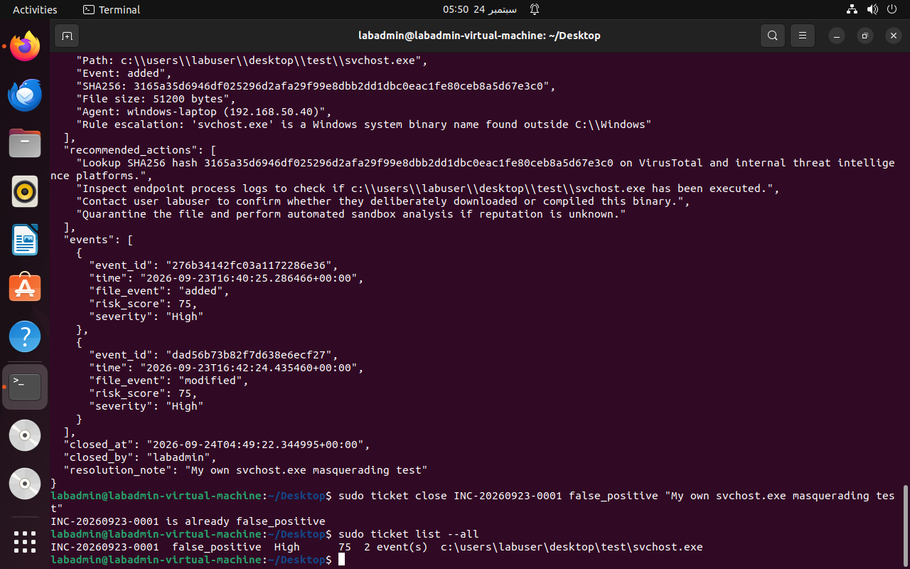

---

## Phase 4: Automated response (host isolation)

The final and highest-risk piece: **Wazuh Active Response**-triggered network isolation on Critical-severity detections, with a Windows Firewall-based containment script that blocks all traffic except to the Wazuh manager — so the agent stays reachable and isolation can be **reversed remotely**, unlike disabling the network adapter outright.

Built and tested in three deliberate stages:

**1. Manual, by-hand testing first** — proving the isolate/unisolate scripts work before any automation touches them, and confirming the agent survives isolation (i.e., release is actually possible):

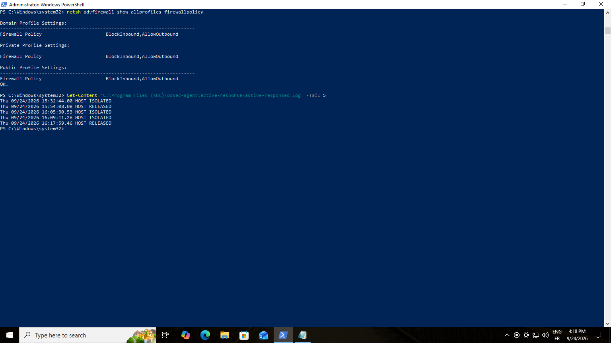
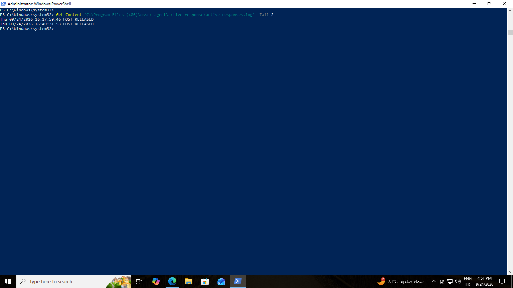

**2. A dedicated, least-privilege API credential.** Rather than give the forwarder admin-level Wazuh API access, I created a scoped user whose *only* permission is `active-response:command` on the one monitored agent — proven by testing that it cannot even list agents:

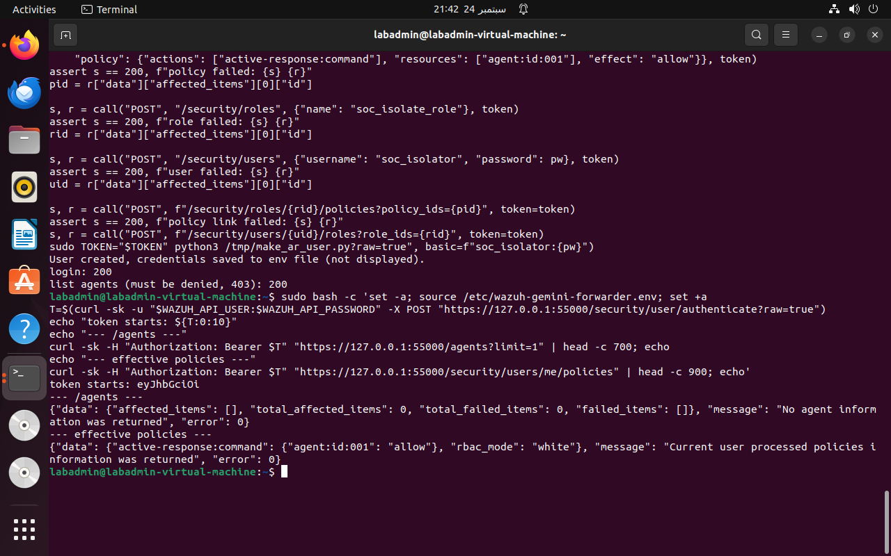

**3. Dry-run mode before live mode.** The forwarder defaults to `ISOLATION_MODE=dry-run`: on a Critical detection it logs "would isolate" and writes that decision into the ticket and Discord — without touching the network — until explicitly switched to live:

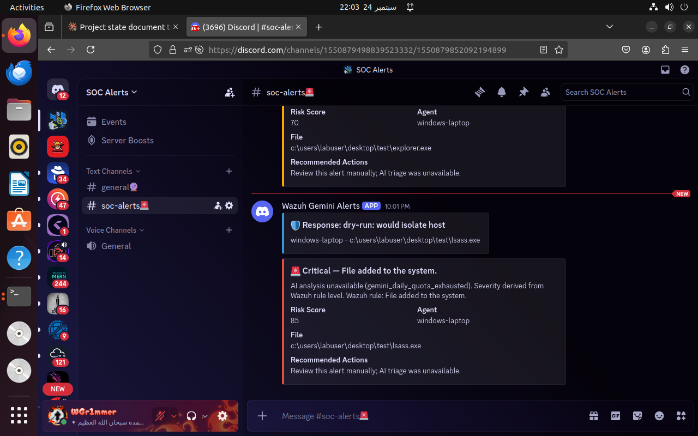
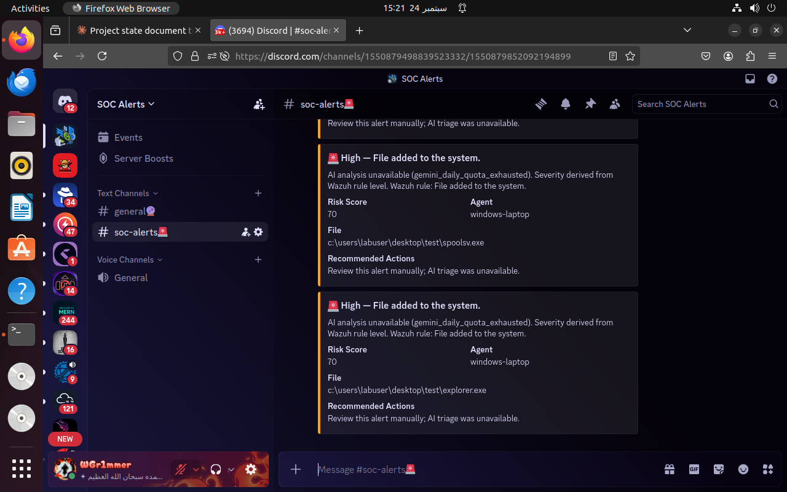

Only after the dry-run was verified end-to-end did I flip to live mode, on a fresh VM snapshot, and run the same Critical trigger (`lsass.exe` masquerading — floor score 85):

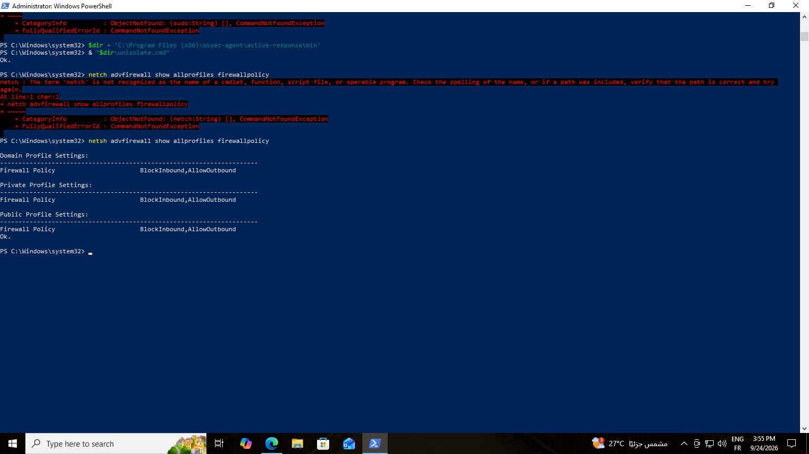
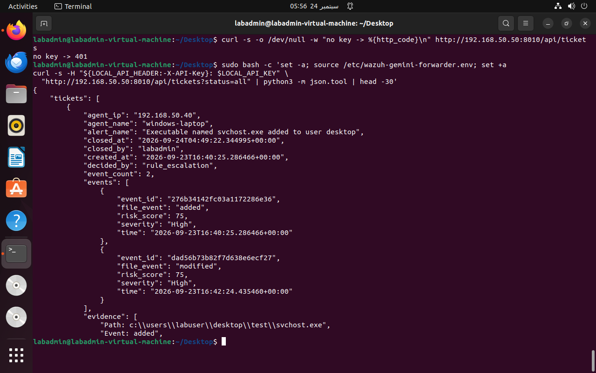

The agent stayed reachable throughout isolation, confirming containment doesn't cut off the SOC's ability to release the host — and a standalone `unisolate` command (using the same least-privilege credential) reversed it and recorded the release back into the ticket:

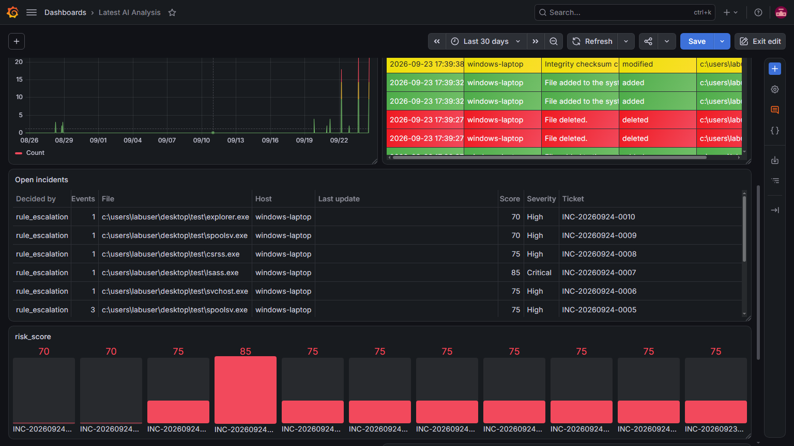

---

## Lessons learned / what I'd do differently

- **Naive retry logic is a single point of failure in disguise.** It looks safe in testing and fails catastrophically the first time a real outage happens. I'd design the bounded-retry + fallback pattern in from day one next time, not after hitting it live.
- **AI scoring needs a deterministic floor for anything security-critical.** An LLM giving a 65 one run and a 70 the next on the *same* input is fine for a chatbot and not fine for a system deciding whether to fire an alert. The rule-based backstop was the single highest-value addition to this project.
- **Least privilege is cheap to build and easy to skip under time pressure.** Creating the scoped `soc_isolator` API user took maybe 15 extra minutes over just reusing the admin credential — and it's the difference between "a compromised forwarder can isolate one specific test agent" and "a compromised forwarder can do anything the SOC admin can do."
- **Dry-run-before-live isn't optional for anything that can cut a machine off the network.** I built and tested it that way on purpose, and I'd insist on the same staging for any future automated-response work — the mode should default to the safe option, not require remembering to set it.
- **VM clock drift is a sneaky, boring bug with outsized consequences.** A stopped/resumed VM's clock silently drifting broke Grafana's session tokens hours later, with an error message that gave no hint the actual cause was time sync. Worth checking first whenever an otherwise-unrelated auth error shows up after a VM restart.

---

## Repo structure

```
soc-detection-response-lab/
├── README.md
├── forwarder/
│   └── wazuh_gemini_forwarder.py      # the AI triage + ticketing + isolation forwarder (secrets via env vars only)
├── active-response/
│   ├── isolate.cmd                    # Wazuh Active Response script — Windows Firewall containment
│   └── unisolate.cmd                  # release script
├── scripts/
│   ├── ticket                         # CLI: list / show / close incident tickets
│   └── unisolate                      # CLI: manually release an isolated host
├── detection-rules/
│   └── sysmon-t1490-custom-rule.xml   # the custom Sysmon rule added for T1490 coverage
└── screenshots/
    └── ...                            # evidence referenced throughout this README
```

## Setup / reproduce this

This isn't a one-command install — it's a lab built incrementally over several sessions, documented as it happened. Rough prerequisites if you want to reproduce it:

1. Two VMs on an isolated network: a Windows 10 endpoint and an Ubuntu 22.04 Wazuh Manager/Indexer/Dashboard host.
2. [Wazuh](https://documentation.wazuh.com/current/installation-guide/index.html) installed on the Ubuntu VM.
3. [Sysmon](https://learn.microsoft.com/en-us/sysinternals/downloads/sysmon) + the [SwiftOnSecurity config](https://github.com/SwiftOnSecurity/sysmon-config) on the Windows VM, with the Wazuh agent's `ossec.conf` extended to read the Sysmon event channel.
4. [Atomic Red Team](https://github.com/redcanaryco/atomic-red-team) installed on the Windows VM for technique simulation.
5. A Google Gemini API key, a Discord webhook, and Python 3 with `requests`, `flask`, and `waitress` for the forwarder in `forwarder/`.
6. A Wazuh API user scoped to `active-response:command` on your agent only (see the Phase 4 section above) — don't reuse an admin credential for this.
7. Grafana with an Infinity data source pointed at the forwarder's authenticated `/api/*` endpoints.

All secrets (API keys, webhook URLs, Wazuh credentials) are read from environment variables at runtime and are never committed to this repo.
